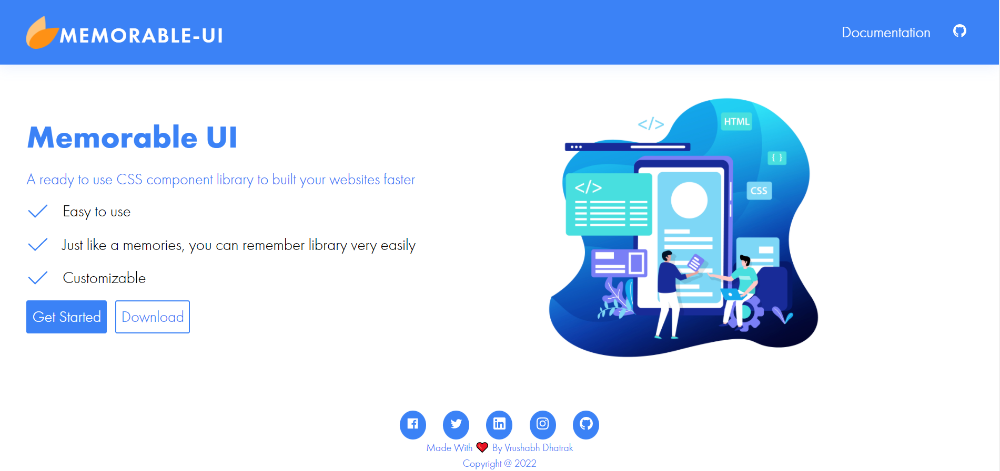
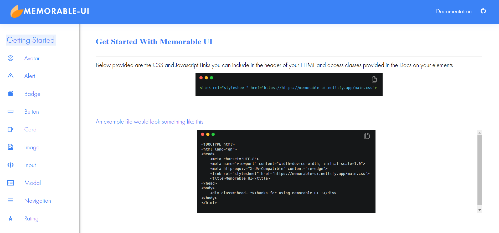

# Memorable UI

 

Memorable UI is a component library that you can use like memory once you start using Memorable UI, it will be just like a memory.

# Installation Steps

Include CSS file mentioned in [installation section](https://memorable-ui.netlify.app/components/getting-start/gettingstart) in your head tag of html file.
And you are ready to use this file.
you can include in the header of your HTML and access classes provided in the Docs on your elements

# Tech Stack
- HTML
- CSS
- JavaScript

***Glad to see you here! Show some love by [starring](https://github.com/Rishi05051997/memorable) this repo.***

  
